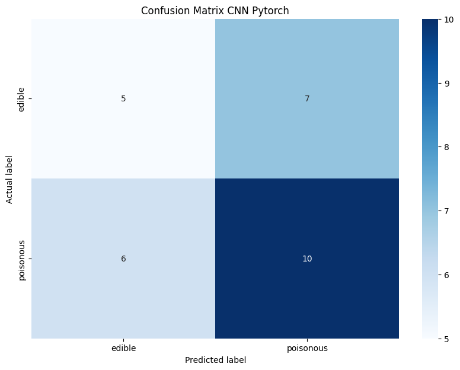
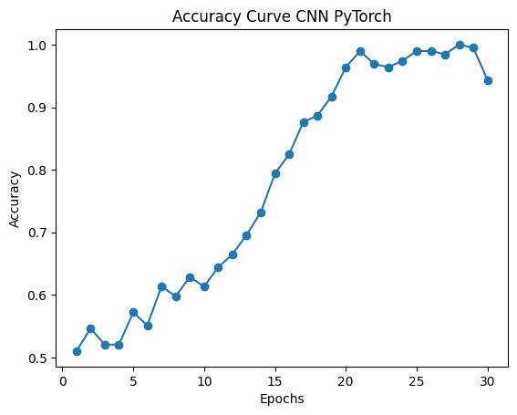

# Critical Analysis of Machine Learning and Deep Learning Model for Mushroom Classification

## Introduction
This project aims to perform critical analysis of a total of 7 models which includes 1 machine learning model and 6 deep learning models and below are the models that are used in this project:-

This project includes the implementation of different machine learning models such as:
 *	Random Forest (Machine Learning Model)
 *	Convolution Neural Network Model using TesorFlow and PyTorch
 *	VGG16 (Deep Learning Model)
 *	MobileNetv2 (Deep Learning Model)
 *	ResNet50 (Deep Learning Model)
 *	ResNet101 (Deep Learning Model)

## Dataset
The dataset is divided into three folders: `train`, `test` and `val`.

The `train` folder contains 194 images, `val` folder contains 28 images and the `test` folder contains 3 images.

Each folder is further divided into 2 classes: `edible` and `poisonous`.

## Model Architecture
Here’s a brief overview of the models used:
 * Random Forest: Random Forest is an ensemble learning method that operates by constructing a multitude of decision trees at training time and outputting the class that is the mode of the classes of the individual trees.
 * Convolutional Neural Network (CNN): CNN is a class of deep neural networks that is most commonly applied to analyzing visual imagery. They are also known as ConvNets. These models are widely used for image classification tasks.
 * VGG16: VGG16 is a pretrained deep learning model that is trained on a large dataset of images. It is a simple and widely used CNN architecture for image classification tasks.
 * MobileNetV2: MobileNetV2 is a lightweight deep learning model that is designed for mobile and embedded vision applications. It is based on the MobileNet architecture and uses depthwise separable convolutions to build lightweight deep neural networks.
 * ResNet50: ResNet50 is a deep learning model that is based on residual learning. It is a 50-layer deep neural network that is widely used for image classification tasks. 
 * ResNet101: ResNet101 is a deep learning model that is based on residual learning. It is a 101-layer deep neural network that is widely used for image classification tasks.


## Installation
You need to have the following softwares installed on your machine:
  * [Python](https://www.python.org/downloads/)
  * [Anaconda Navigator](https://www.anaconda.com/products/distribution)
  * [Juypyter notebook](https://jupyter.org/install)

Follow the below steps to run the code in your local machine:
  1.	Clone the repository:
```bash
git clone https://github.com/Akashdip-N/Mushroom-Classification.git
cd Mushroom-Classification/
```
  2. Create a virtual environment:
```bash
conda create --name myenv python=3.10.14
conda activate myenv
```
  
  3. Install the required packages:
```bash
pip install -r requirements.txt
```
  4.	Clone the repository which contains the dataset using the following command:
```bash
git clone https://github.com/Akashdip-N/Dataset.git
```
  
  5. Create a new folder named config and inside it create a file named `config.json` and add the following code:
```json
  {
    "Pth_Files": "Mushroom-Classification/Pth_Files",
    "dataset_path": "Dataset/",
    "train_path": "Dataset/train",
    "val_path": "Dataset/val",
    "test_path": "Dataset/test"
  }
```


## Usage

To execute the code, follow the steps below:
  * Open the jupyter notebook
  * Open the all the files with the extension `.ipynb`
  * Run the cells

## Results
After the execution of the code is completed, the results of the models will be displayed in the form of accuracy, precision, recall, and F1-score and training accuracy curve for all the models.

The confusion matrix will look something like this:


The training accuracy curve will look something like this:


The F1-score, precision, accuracy and recall will look something like:


## Contributing
Contributions are welcome! Please submit a pull request or open an issue to suggest any improvements or report bugs.

## License
This project is licensed under the CC0 1.0 Universal - see the LICENSE file for details.
